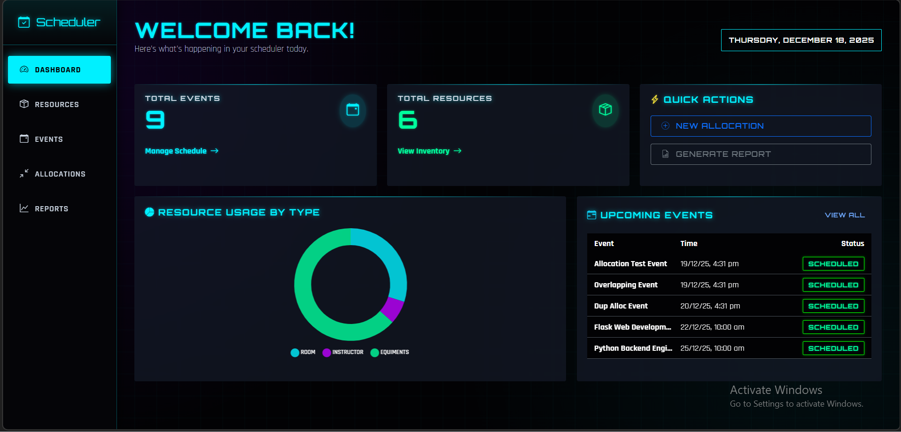

## Dashboard
[](Gokul%20Krishnan%20YN%20%20Event-Scheduling-Resource-Allocation-System.mp4)

If the video doesn't play, [download it here](Gokul%20Krishnan%20YN%20%20Event-Scheduling-Resource-Allocation-System.mp4).

## Feature Previews
| **Resource Management** | **Event Management** |
|:---:|:---:|
|  |  |

A full-stack web application for scheduling events and allocating shared resources (rooms, equipment, instructors) with built-in conflict detection and reporting.

## Key Features
-   **Cyberpunk Glassmorphism UI**: A futuristic, high-contrast dark theme with neon accents (`#00f0ff`, `#bd00ff`) and semi-transparent "glass" cards.
-   **Interactive Dashboard**: Real-time stats, neon-glowing charts, and upcoming event tracking.
-   **Smart Conflict Detection**: Automatically prevents double-booking resources with visual alerts.
-   **Resource Management**: comprehensive CRUD for rooms, equipment, and instructors.
-   **Advanced Reporting**:
    -   **Usage Rings**: Neon doughnut charts showing utilization percentages.
    -   **Comparison Analysis**: Bar charts contrasting booking counts vs. total hours.

## Tech Stack
-   **Backend**: Flask (Python), SQLAlchemy, SQLite/MySQL
-   **Frontend**: HTML5, CSS3 (Custom variables, Flexbox/Grid), Bootstrap 5 (Dark Mode overridden)
-   **Visuals**: Chart.js (configured for dark themes), Google Fonts (Orbitron & Rajdhani)

## Prerequisites
- Python 3.8+
- MySQL Server

## Setup Instructions

### 1. Database Setup
Create an empty MySQL database:
```sql
CREATE DATABASE event_scheduling_db;
```
Update `.env` with your credentials:
```ini
DB_HOST=localhost
DB_USER=root
DB_PASSWORD=your_password
DB_NAME=event_scheduling_db
```

### 2. Application Setup
```bash
# Install dependencies
pip install -r requirements.txt

# Run the application
python app.py
```
*Note: The database tables will be created automatically on first run via the `/api/init-db` logic or manual call.*

**First Time Run:**
Use Postman or Curl to initialize tables unique constraints if not auto-created:
`POST http://localhost:5000/api/init-db`

Access the app at `http://localhost:5000`.

## Conflict Logic
The system uses the following logic to detect overlaps:
```python
Existing.start_time < New.end_time AND Existing.end_time > New.start_time
```
This ensures that no two events using the same resource can overlap in time.

## Contact
Submitted by: Gokul Krishnan Y N

## Test Cases Covered

### A. Event Management
- [x] TC-E01: Create Event (Valid)
- [x] TC-E02: Missing Description (Validating Error)
- [x] TC-E03: Space-only Description (Validating Error)
- [x] TC-E04: Invalid Time Range (Start >= End)

### B. Resource Management
- [x] TC-R01: Create Resource (Valid)
- [x] TC-R04: Duplicate Resource Name (Uniqueness Check)

### C. Resource Allocation
- [x] TC-A01: Allocate Resource (Valid)
- [x] TC-A02: Overlapping Allocation (Conflict Detection)
- [x] TC-A07: Duplicate Allocation (Integrity Check)

### E. Reports
- [x] TC-U01: Utilization Report Generation
